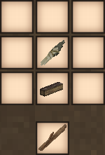
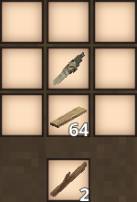
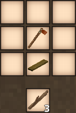
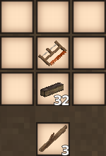
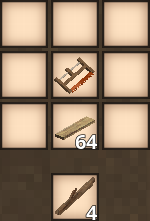

# VintageSticks

**VintageSticks** is a lightweight content mod for _Vintage Story_ that adds the one thing the base game curiously lacks — **a reliable way to craft sticks directly from wood**.  
Instead of relying only on world generation and RNG, players can now produce sticks through intuitive crafting based on available tools and progression.

## 🪵 Why This Mod Exists

In early game, you often struggle for sticks despite being surrounded by wood.  
This mod solves that bottleneck with **progressive crafting efficiency**:

| Tool Material →      | 🔪 Knife + Firewood | 🔪 Knife + Plank | 🪓 Axe + Firewood | 🪓 Axe + Plank | 🪚 Saw + Firewood | 🪚 Saw + Plank  |
|----------------------|---------------------|------------------|-------------------|----------------|-------------------|-----------------|
| Sticks Produced      | 1                   | 2                | 2                 | 3              | 3                 | 4               |
| Tool Durability Cost | 3                   | 3                | 4                 | 4              | 5                 | 5               |
| Intended Stage       | Early Improvised    | Early-Mid        | Mid Efficient     | Mid-Late       | Late Optimal      | Best Production |

🔹 _Better tools = more sticks per piece of wood._  
🔹 _Firewood is your foundation — planks become superior for bulk crafting._

This system keeps the game balanced, immersive and progression-friendly.

## ✨ Features

- Adds multiple intuitive crafting recipes for sticks
- Tool-based efficiency progression (knife → axe → saw)
- Firewood or planks can be processed based on progression
- No game balance is broken — you still need tools and wood
- Doesn't modify worldgen or vanilla drop rates
- No conflicts with vanilla recipes (vertical placement avoids wooden paths conflict)

## 📥 Installation

### ModDB (recommended)
https://mods.vintagestory.at/vintagesticks

### Manual Installation
1. Install **Vintage Story 1.21+**
2. Download `.zip` from GitHub Releases  
   → https://github.com/HarukaYamamoto0/vintage-sticks/releases
3. Place the `.zip` inside your game's `Mods/` directory
4. Launch the game and ensure the mod is enabled

## 🔨 Crafting Recipes

| Recipe                      | Preview                                            |
|-----------------------------|----------------------------------------------------|
| Knife + Firewood → 1 Stick  |  |
| Knife + Plank → 2 Sticks    |      |
| Axe + Firewood → 2 Sticks   |      |
| Axe + Plank → 3 Sticks      |          |
| Saw + Firewood → 3 Sticks   |    |
| Saw + Plank → 4 Sticks      |          |

_All recipes use vertical placement (tool above material) to avoid conflicts with vanilla horizontal recipes._

## 🔄 Compatibility

- Works with **Vintage Story 1.21+**
- Pure content mod — no DLLs required
- Should be compatible with most mods
- No worldgen or item overrides conflicts

## 💡 Contributing

Suggestions, feedback & PRs are welcome.

🔗 Issues: https://github.com/HarukaYamamoto0/vintage-sticks/issues

## 📄 License

Licensed under **MIT**, do whatever you want — just credit.

## ❤️ Credits

Inspired by  
**Uparu** → _Create Sticks_  
https://mods.vintagestory.at/show/mod/23863

VintageSticks is a **clean, balanced and expanded evolution** of the original concept.

> _"A stick may seem small — but from it, every tool is born."_